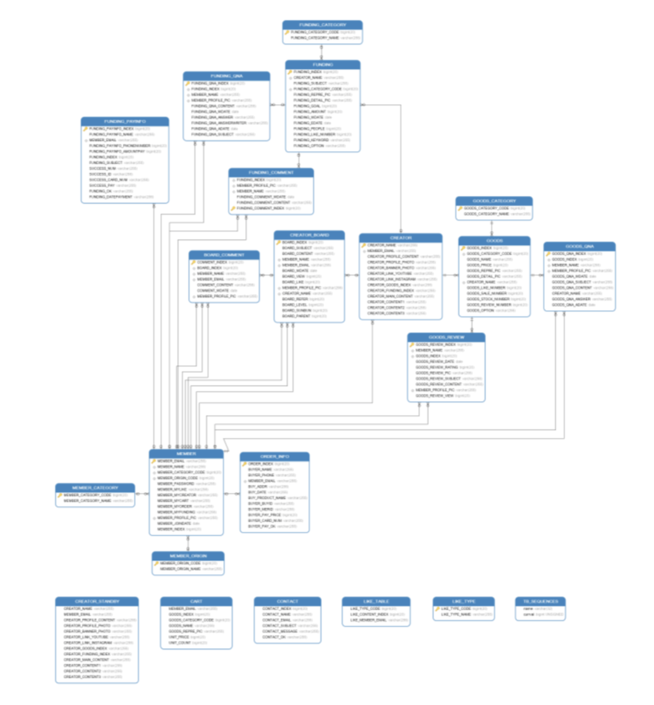
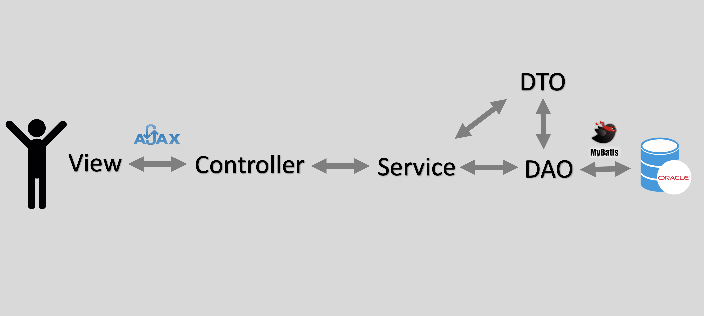
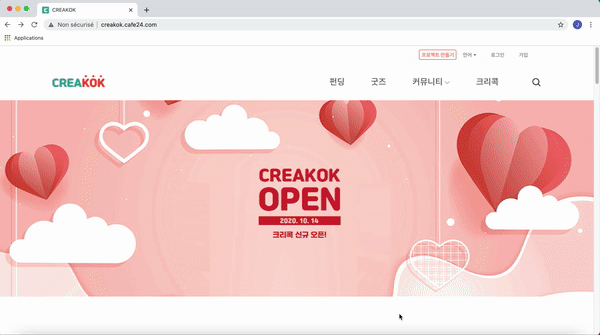
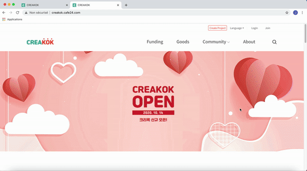
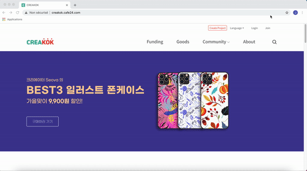

# ABOUT PROJECT
#### [ Creakok ] Développement Site Web Crowdfunding en Java/Spring : Spring MVC Pattern, Intégration de paiement API (I'amport), Ajax, Social Log-in(API)
*( 2020.07.01 ~ 2020.07.08 )*

## 1. Membres de l'équipe

|*Members*|*Contact*|
|:---:|---|
|**Joohyun ANN**| |
|**Hyunchul BAE**| |
|**Jihee SEO**| |
|**Hyungsub Kim**| |

## 2. Visiter le site
http://creakok.cafe24.com/

   
## 3. Présentation du projet
&nbsp; Ayant eu l'idée de réaliser une plateforme qui permet d'interconnecter les créateurs et son public, nous avons réalisé un site web de crowdfunding.
Pour **les membres public**, ils peuvent **participer au projet en investissant** une somme à son choix, **acheter les objets créatifs**, et de **communiquer.** 
Pour **les créateur**, ce site permet d'avoir de **l'investissement de son projet**, **vendre les objets de création**, et de **communiquer avec son public.**   

Tout le monde peut **s'inscrire à Creakok** et vous avez la possibilité de se joindre avec un compte de **GMail, Naver, ou Kakao.**
**Chaque créateurs** possèdent sa propre **page de forum** et peuvent **créer des projet de Funding** et mettrent en **vente ses objets de création**.
Pour devenir créateur de Creakok, le dépôt de demande via notre site est obligatoire.
L'équipe de Créakok examinera la demande et effectuera l'authorisation du compte Créateur dans un delai de 5 jours ouvrables.  

> *"CROWDFUNDING : Le financement participatif, ou sociofinancement, est un outil de collecte de fonds fonctionnant sur une plateforme 
internet et permettant à un ensemble de contributeurs de choisir collectivement de financer directement et de manière traçable des projets identifiés."* 

## 4. Database

 
&nbsp; Création de 22 tables au total a été réalisée. 

## 5. MVC Pattern

 
&nbsp; La réalisation du projet a été basé du **MVC Pattern** dans **Spring Framework**. 
Pour le **Model**, nous avons eu le côté **Model** et **VO** afin de faciliter la maintenance du site en divisant clairement les attributs de **DTO (Data Transfer Objet)** et **VO(Value Objet)**.
Un **Controller** a été crée par chaque service, et nous avons éssayé de simplifier le codage des controllers pour que son fonctionnement et la stransmission des datas soient clairs.
Ainsi, c'était dans le **Service** que l'on a traité la logique et la business logic. De plus, l'utilisantd de **MyBatis** a permis d'écrire et de gérer les requêtes SQL plus simplement.
Enfin, pour offrir une expérience plus claire et dynamique, nous avons utilisé **Bootstrap** pour construire **View**.

## 6. Technologie 

# Results
## 1. Résultat
### *Main Page*
  

 
&nbsp;Proposition des projets à investir(Funding) & Classement des Funding et Goods  

 
&nbsp;Présentation des Créateurs & Lien pour les Forums de Communication 

---

### *Funding*

 
&nbsp; La page Funding montre les projets qui sont en cours de Crowdfunding. 
Vous avez la possibilité de voir selon la catégorie de projet, de changer l'ordre de présentation, et de changer le nombre de projets par page. (Popularité décroissante, 3 projets par page : par défaut)

 
&nbsp; Chaque projet Funding possèdent un forum de Q&A, ainsi qu'une page qui présente les règles de crowdfunding. Seul les membres de Creakok peuvent mettre un poste et peuvent aussi enregistrer les projets intéressants 
dans son compte en cliquant le boutton cœur. Il y a également un boutton à disposition qui permet de partager le lien.

 
&nbsp; Participation du crowdfunding d'un projet se fait en payant le montant de son choix. Vous avez la possibilité de payer avec la carte visa, mastercard, kakao, 
et etc. La liste des participation peuvent être consulté dans son compte.

 
&nbsp; Le lien vers le forum de discussion du créateur est à disposition. De plus, en bas de la présentation du projet il existe des projets similaires qui apparait afin de proposer d'autres funding qui peuvent
intéresser les utilisateurs.

---

### *Goods*

 
&nbsp; La page Goods montre les objets en vente des créateurs.
Vous avez la possibilité de voir ces objets selon la catégorie de projet (à gauche), de changer l'ordre de présentation, et de changer le nombre de projets par page. (Popularité décroissante, 3 projets par page : par défaut)
Lors que vous touchez l'article, il y a deux bouttons qui apparait, pour mettre dans la liste de mes favoris, ainsi que pour mettre dans son panier.

 
&nbsp; Chaque Goods possèdent un forum de Review (commenatire), Q&A, ainsi qu'une page qui présente les détails de l'article. 
Seul les membres de Creakok peuvent mettre un poste et peuvent aussi enregistrer les projets dans ses favoris
dans son compte en cliquant le boutton cœur. Il y a également un boutton à disposition qui permet de acheter de suite. 

 
&nbsp; L'achat de Goods demande la connexion de son compte. Vous avez la possibilité de payer avec la carte visa, mastercard, kakao, 
et etc. La liste des commande peuvent être consulté dans son compte.

 
&nbsp; Le lien vers le forum de discussion du créateur qui vend le produit est à disposition. De plus, en bas de la présentation du projet il existe des articles similaires afin de proposer d'autres articles qui peuvent
intéresser les utilisateurs.

---

### *Log-in / Log-out*

 - **Se Connecter**
 

  
 &nbsp;L'inscription se fait avec l'adresse mail. Une fois se connectée, la déconnexion est demandée afin de se reconnecter. Grâce à l'API, vous avez la possibilité de s'inscrire avec le compte Gmail, Kakao, Naver ou avec un simple adresse mail.
 
 - **Comptes**
 
  &nbsp;Il existe trois comptes différents, **Super**(qui gère les demandes de compte créateurs et la gestion de site), **Créateur**, et **Membres**
---

### *Community*

 
&nbsp;Chaque créateurs possèdent un forum afin de discuter avec son public. Il y a un lien qui amène vers sa page Youtube avec quelques contenus de vidéo intéressante.
Tous les membres peuvent discuter dans n'importe quel forum. De plus, la recherche d'un poste et le tirage de l'ordre différent sont à disposition.

 
&nbsp;Une fois connecté, on a également la possiblité de mettre un commentaire sur un poste, ou bien modifier le poste si la créateur du poste est soi-même.

---

### *About*

 
&nbsp; La présentation de trois service que l'on offre, Funding, Goods, Community, ainsi que les liens pour créer des projets Fundings ou des ventes de Goods sont à disposition.

---

### *My page*

 
&nbsp;La page Mon Compte est différente selon le status du compte (Super, Créateur ou Membre). En générale, nous avons ces 4 fonctionnements. 
  1. Liste de mes favoris
  2. Modification des infos de mon compte
  3. Liste des commandes Goods
  4. Liste des participation Funding
  
---

