# ABOUT PROJECT
#### [Creakok] 자바 / Spring에서의 크라우드 펀딩 웹 사이트 개발 : Spring MVC Pattern, Payment Integration API (I'amport), Ajax, Social Log-in (API)
*( 2020.08 ~ 2020.10 )*

## 1. 팀원

|*Members*|*Contact*|
|:---:|---|
|**안주현**| |
|**배현철**| |
|**서지희**| |
|**김형섭**| |

## 2. 사이트 방문
http://creakok.cafe24.com/

   
## 3. 프로젝트 발표
&nbsp; 제작자와 시청자를 연결하는 플랫폼을 만들 겠다는 생각을 가지고 크라우드 펀딩 웹 사이트를 만들었습니다. 들어 **공공 회원** , 그들은 수 있습니다 **투자하여 프로젝트에 참여** , 그들의 선택의 양을 **창조적 객체를 구입** 하고 **통신 할 수 있습니다.** 들어 **제작자** ,이 사이트에 당신이 할 수 있습니다 **프로젝트에 투자** , **창조적 인 객체를 판매** 하고 **청중과 통신합니다.**  

누구나 **Creakok** 에 가입 할 수 있으며 **GMail, Naver 또는 Kakao 계정** 으로 가입 할 수 있습니다. **각 제작자** 는 자신의 **포럼 페이지**를 가지고 있으며 **자금 조달** 프로젝트를 **만들고 창작품을 판매** 할 수 있습니다 . Creakok의 제작자가 되려면 당사 사이트를 통해 신청서를 제출해야합니다. Créakok 팀은 영업일 기준 5 일 이내에 요청을 검토하고 Creator 계정을 승인합니다.  

> *"크라우드 펀딩 : 크라우드 펀딩 또는 크라우드 펀딩은 인터넷 플랫폼에서 작동하는 모금 도구이며, 기여자들이 확인 된 프로젝트를 추적 가능한 방식으로 직접 자금을 조달 할 수 있도록 공동으로 선택할 수 있도록합니다."* 

## 4. Database

 
&nbsp; 총 22 개의 테이블 생성이 수행되었습니다.

## 5. MVC Pattern

 
&nbsp; 프로젝트의 실현은 **Spring Framework** 의 **MVC 패턴** 을 기반으로했습니다 . 를 들어 **모델** , 우리는 한 **모델** 과 **VO** 측 명확의 특성 나누어 사이트 유지 보수를 용이하게하기 위해 **DTO (데이터 전송 개체)** 및 **VO (값 개체)** . **컨트롤러**는 각 서비스에 의해 만들어진, 우리는 그 작동과 데이터의 전송이 명확 있도록 컨트롤러의 코딩을 단순화하기 위해 노력했다. 따라서 우리가 로직과 비즈니스 로직을 다룬 것은 **서비스** 에서였습니다 . 또한 **MyBatis** 사용SQL 쿼리를 더 쉽게 작성하고 관리 할 수 ​​있습니다. 마지막으로 더 깨끗하고 동적 인 경험을 제공하기 위해 **Bootstrap** 을 사용하여 **View** 를 빌드했습니다.

## 6. 기술
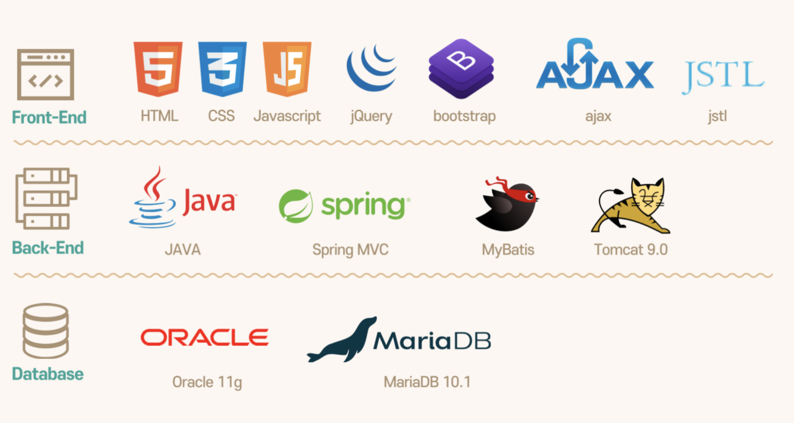
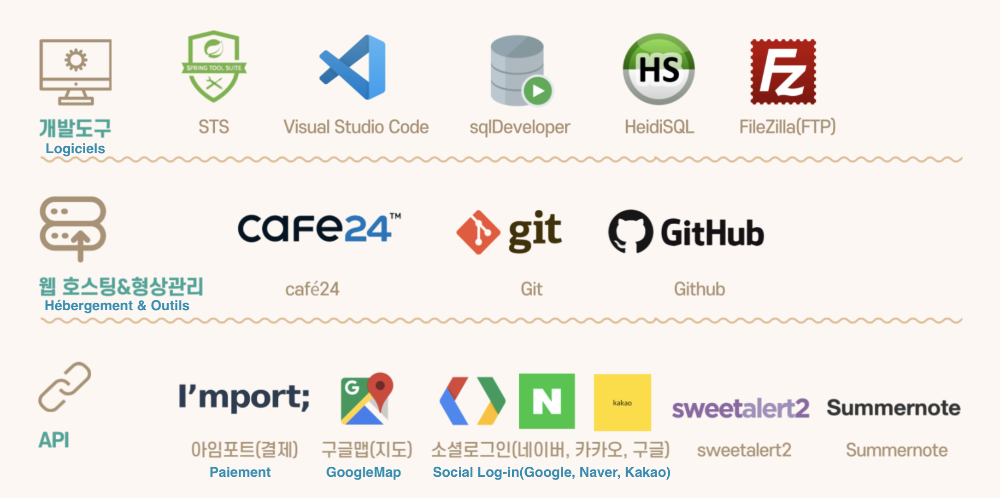

# 결과
## 1. 결과
### *Main Page*
  

 
&nbsp;투자 프로젝트 제안 (펀딩) 및 펀딩 및 상품 랭킹
 크리에이터 발표 및 커뮤니케이션 포럼 링크

---

### *Funding*
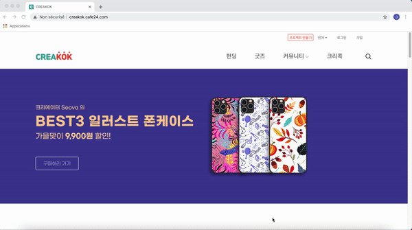
 
&nbsp; 펀딩 페이지는 현재 크라우드 펀딩 프로젝트를 보여줍니다. 프로젝트 범주별로보고, 프레젠테이션 순서를 변경하고, 페이지 당 프로젝트 수를 변경할 수 있습니다. (인기 감소, 페이지 당 3 개 프로젝트 : 기본적으로)

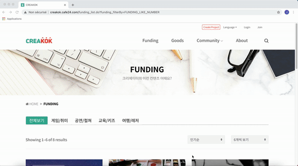
 
&nbsp;  각 펀딩 프로젝트에는 Q & A 포럼과 크라우드 펀딩 규칙을 설명하는 페이지가 있습니다. Creakok 회원 만이 작업을 게시 할 수 있으며 하트 버튼을 클릭하여 흥미로운 프로젝트를 자신의 계정에 저장할 수도 있습니다. 링크를 공유 할 수있는 버튼도 있습니다.

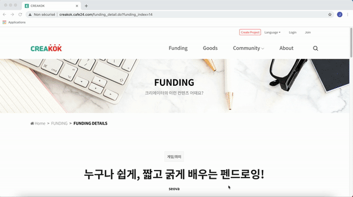
 
&nbsp; 프로젝트 크라우드 펀딩 참여는 자신이 선택한 금액을 지불함으로써 이루어집니다. 삼성 카드, 현대, BC, 카카오, 페이 코 등으로 결제가 가능합니다. 참여 목록은 그의 계정에서 볼 수 있습니다.

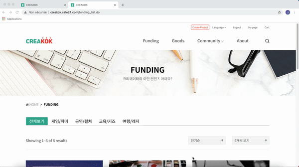
 
&nbsp; 제작자의 토론 포럼에 대한 링크를 사용할 수 있습니다. 또한 프로젝트 프레젠테이션 하단에는 사용자가 관심을 가질 수있는 다른 자금을 제공하기 위해 유사한 프로젝트가 나타납니다.

---

### *Goods*
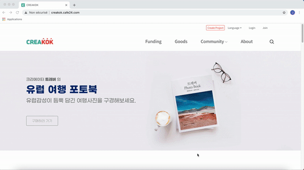
 
&nbsp; 상품 페이지에는 판매 할 디자이너 상품이 표시됩니다. 프로젝트 범주 (왼쪽)에 따라 이러한 개체를보고, 프레젠테이션 순서를 변경하고, 페이지 당 프로젝트 수를 변경할 수 있습니다. (인기 감소, 페이지 당 3 개 프로젝트 : 기본적으로) 기사를 터치하면 내 즐겨 찾기 목록에 넣고 그의 바구니에 넣을 수있는 두 개의 버튼이 나타납니다.

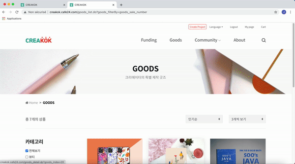
 
&nbsp; 각 상품에는 리뷰, Q & A 포럼 및 기사의 세부 정보를 제공하는 페이지가 있습니다. Creakok 회원 만 작업을 게시 할 수 있으며 하트 버튼을 클릭하여 자신의 계정에서 즐겨 찾기에 프로젝트를 저장할 수도 있습니다. 즉시 구매할 수있는 버튼도 있습니다.
 
제품을 판매하는 제작자의 토론 게시판 링크를 사용할 수 있습니다. 또한 프로젝트 프레젠테이션 하단에는 사용자가 관심을 가질만한 다른 기사를 제안하기 위해 유사한 기사가 있습니다.

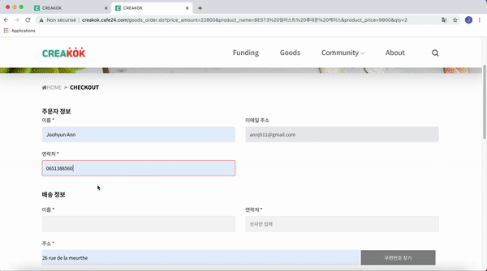
 
&nbsp; 상품을 구매하려면 계정 연결이 필요합니다. 비자 카드, 마스터 카드, 카카오 등으로 결제 할 수 있습니다. 주문 목록은 그의 계정에서 볼 수 있습니다.

---

### *Community*
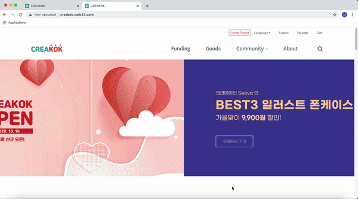
 
&nbsp;  각 제작자에게는 시청자와 토론 할 수있는 포럼이 있습니다. 흥미로운 비디오 콘텐츠가있는 그의 유튜브 페이지에 대한 링크가 있습니다. 모든 회원은 모든 포럼에서 채팅 할 수 있습니다. 또한 위치 검색 및 다른 순서의 도면이 가능합니다.

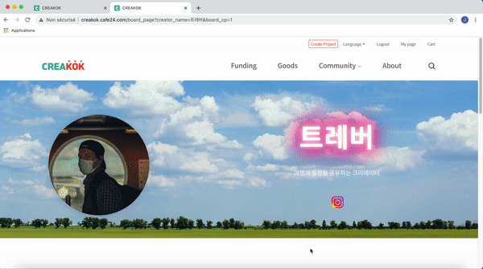
 
&nbsp; 로그인하면 게시물에 댓글을 추가하거나 게시물 작성자가 본인 인 경우 게시물을 수정할 수도 있습니다.

---

### *About*

 
&nbsp; 우리가 제공하는 세 가지 서비스 인 Funding, Goods, Community 및 Funding 프로젝트 생성 또는 상품 판매 링크를 사용할 수 있습니다.

---

### *My page*

 

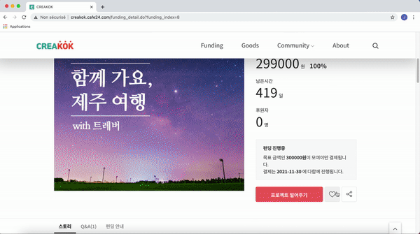
 

&nbsp; 내 계정 페이지는 계정 상태 (슈퍼, 크리에이터 또는 멤버)에 따라 다릅니다. 일반적으로 다음과 같은 4 가지 작업이 있습니다. 
  1. 내 즐겨 찾기 목록
  2. 내 계정 정보 수정
  3. 상품 주문 목록
  4. 펀딩 참여 목록
  
---

### *Log-in / Log-out*

 - **로그인하기**
 
&nbsp; 등록은 이메일 주소로 이루어집니다. 일단 연결되면 다시 연결하기 위해 연결 해제를 요청합니다.
 
API 덕분에 Gmail, 카카오, 네이버 계정 또는 간단한 이메일 주소로 등록 할 수 있습니다.
 
 
 - **계정**
 
  &nbsp; **Super** (크리에이터 계정 요청 및 사이트 관리를 처리), **Creator** 및 **Members**의  세 가지 계정이 있습니다 .
  
---
